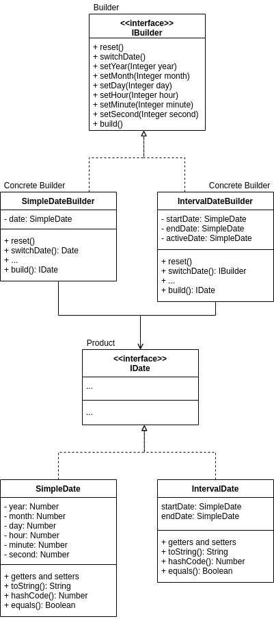
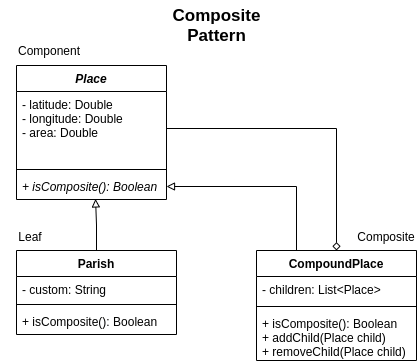
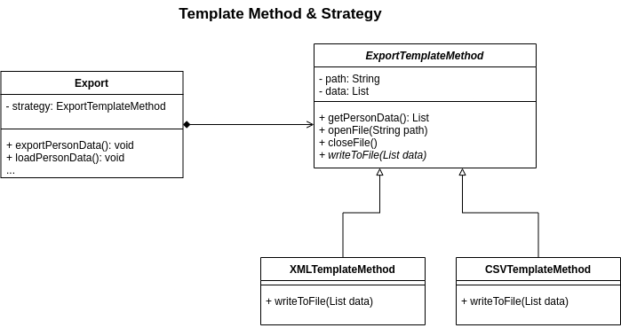

# Report

# Functionalities Made So Far
The main functionalities of the program implemented already without GUI are:
- Allow record of **places**
- Allow record of **dates**
    - Both **simple** and **interval** dates
- Allow record of **events**
    - For this iteration it can only record 2 types of events (Birth and Custom)
- Allow record of **people**

# Introduction
At this document it will be explained what was the process to develop this platform. This software system helps to support the work of historians and individual genealogy researchers by storing data related to individuals, their relations, and other important kinds of information.

<!-- # Goals -->

# The Design

## Solving Simple Dates Snd Intervals
We'll start by explaining how we solved the problem of having uncertain dates.

### Problem In Context
We have to save two different dates, **Interval** and **Simple** dates. The difference between them is that one just has a simple date (10-11-2021 00:00:00) and the other is an interval date (10-11-2021 00:00:00 - 24-12-2021 23:20:00). And this is not all, we also have to pay attention that dates may be incomplete.

### Design Problem To Solve
The problem with dates was that they could be **incomplete**, which meant that we would need to have a lot of different constructors for the various possibilities or send params with null on the constructor.

### The Pattern
For the problem that we are trying to solve, the **Builder Pattern** is the one that best applies since the specification of the problem is exactly what it solves. The *Builder Pattern* extracts the object construction code out of the class and moves it to separate objects called builders. This way it makes it possible to “build” a date without the need for complex constructors and in a more structured way. The pattern solves the problem of **two different types of dates** since we can have **different builders** for each of them.

### Implementation
For the implementation of the builder pattern, we created an interface **Ibuilder** that contains all the methods to be implemented by the concrete builders: **SimpleDateBuilder** and **IntervalDateBuilder**. We had to create two concrete classes for the dates being created by the builders: **SimpleDate** and **IntervalDate**.

### Consequences
One of the consequences of the builder is that it doesn’t allow other objects to access the date while it’s being built and for this use case it doesn’t matter so we didn’t identify any other problem.

---

## Solving The Insertion Of Locations
Finding a structured way to store locations was also something we had to look into. We explain the process below.

### Problem In Context
The problem is finding a structured way to **save locations**. These locations have the particularity that they can be **contained** within other locations or themselves contain thirds. For example, the district Porto is a location. Porto contains countys like Porto itself, Amarante, Felgueiras, Vila Nova de Gaia, etc. This countys are also locations and they can have other locations inside them.

### Design Problem To Solve
Therefore, what needs to be resolved is this way of structuring locations so that districts can contain counties, counties can contain parishes, and in the end, everything that was listed above has to be called by location.

### The Pattern
The problem that was described above can be visually transcribed to a **tree structure** where there are parent locations that give rise to child locations. The pattern that allows the implementation of such structures is the **Composite Pattern**. This pattern is the best ally of this kind of tree structures so it was the one we chose to solve the location problem.

### Implementation
As far as implementation is concerned, we had to create a abstract class **Place** that has similar attributes to the different types of locations (latitude, longitude, area). This class plays the role of **Component** within what is estipulated by the **Composite Pattern**. Next we created, the **CompoundPlace** class which **extends Place** and plays the role of **Composite**. This *Composite* schematizes the case of locations such as Porto that contains other locations and therefore need some way to aggregate others. The composite will allow this. It will have a list with all the children locations, all of them of the **Place** type. Which means that we can either add final locations (Leafs) or a Composite itself. Lastly, the **Parish** class also **extends Place** and refers to a location that will not include other locations. So, the **Parish** class, as it was implicitly said before, maps directly to a **Leaf** on the *Composite Pattern*.

### Consequences
- Positive consequences:
    - Thinking of the various locations as nodes in a tree is a very natural way to solve this data structuring problem.
    - It is a pattern that very easily incorporates with the **Builder Pattern** in order to allow the quick insertion of locations in the tree.
    - It will be necessary to iterate through these locations in order to choose the one that interests us. Given this, the composite pattern makes it easy to use an **Iterator Pattern** to traverse the various nodes of the tree.
- Negative consequences:
    - If for some reason a **Leaf** location becomes **Composite** we will need to add logic to transform this *Leaf* into *Composite* which may not be solved trivially.

---

## Solving Exporting/Loading Data In Different Formats
And now, how do we export, for instance the locations, in different formats?

### Problem In Context
It was required to **load and save** data using **different formats** (e.g. CSV, XML, GEDCOM) and having in mind that new export formats should be easy to add.

### Design Problem To Solve
The problem here was that not only would we need to use **many strategies** at a time to load or save data, but also that **some of the steps** required to do this will be **shared among all strategies**.

### The Pattern
To solve this problem, a mix of the **Strategy Pattern** and **Template Method Pattern** was used. It was used the **Strategy Pattern** in the sense that there are **various strategies** in place to load or save data in various formats which follow a **common interface**. With this, it is only necessary to **choose a strategy before using the same methods**, regardless of the strategy type. The Template Method Pattern was introduced to keep some of the data processing that all strategies follow in a common place. With this, these methods stay in the abstract class letting the specific work to be implemented by each strategy.

### Implementation

Since most of the steps are located on the abstract class, this implementation is more of a Template Method Pattern than a Strategy Pattern.

### Consequences
- Positive consequences:
    - By using this approach, not only is it possible to **add new support** for new types of files but also gives the freedom to the program to **switch between different strategies** of exporting or loading, just like it is necessary.
    - We are effectively **deleting repeated code** by putting it in abstract class.
- Negative consequences:
    - If the use of a specific type of file needs more steps than the general ones defined, it may need to join more than one step at the same method since we are limiting the structure of an algorithm.