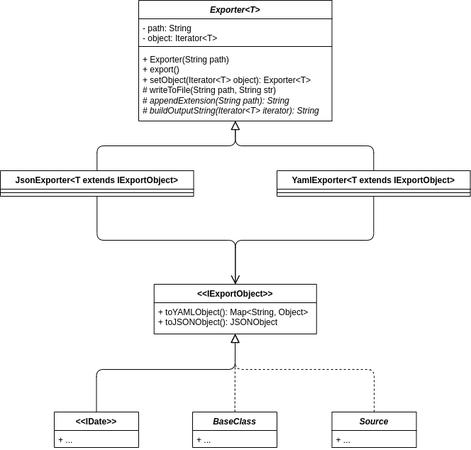
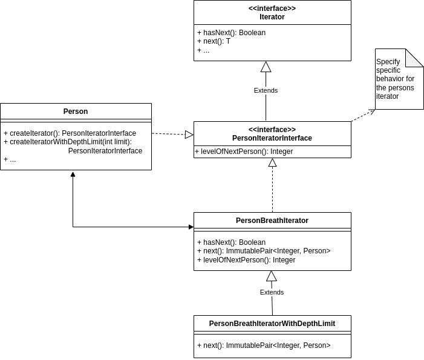
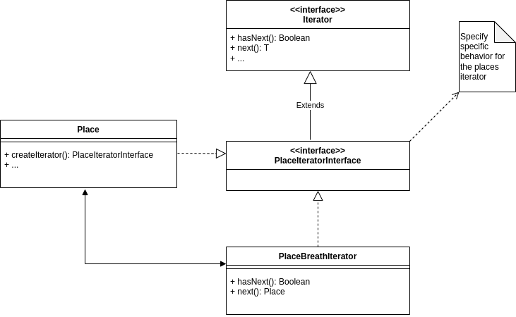
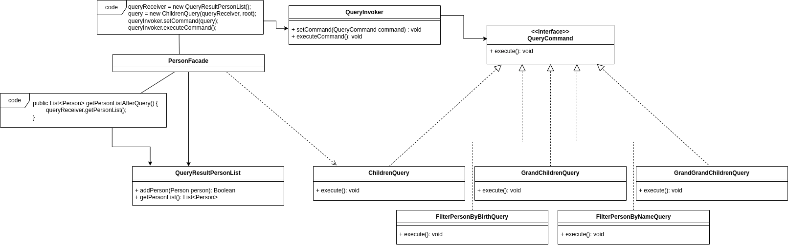
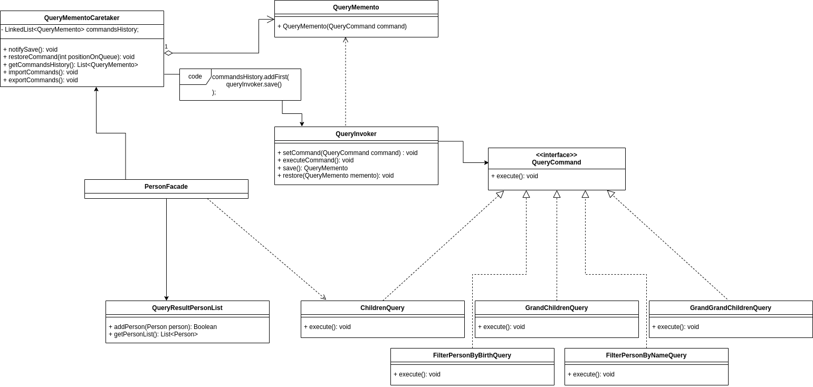

# Report

At this document it will be explained what was the process to develop this platform. This software system helps to support the work of historians and individual genealogy researchers by storing data related to individuals, their relations, and other important kinds of information.

# Table of contents
- [Report](#report)
- [Table of contents](#table-of-contents)
- [Functionalities Made](#functionalities-made)
- [The Design](#the-design)
  - [Solving Simple Dates And Intervals](#solving-simple-dates-and-intervals)
    - [Design Problem](#design-problem)
    - [The Pattern](#the-pattern)
    - [Implementation](#implementation)
    - [Consequences](#consequences)
  - [Solving The Location Structure](#solving-the-location-structure)
    - [Design Problem](#design-problem-1)
    - [The Pattern](#the-pattern-1)
    - [Implementation](#implementation-1)
    - [Consequences](#consequences-1)
  - [Solving Exporting/Loading Data In Different Formats](#solving-exportingloading-data-in-different-formats)
    - [Design Problem](#design-problem-2)
    - [The Pattern v1](#the-pattern-v1)
    - [Implementation v1](#implementation-v1)
    - [Consequences v1](#consequences-v1)
    - [The Pattern v2](#the-pattern-v2)
    - [Implementation v2](#implementation-v2)
  - [Solving The Complexity Of Instantiating/Editing/Removing The Different Types Of Objects](#solving-the-complexity-of-instantiatingeditingremoving-the-different-types-of-objects)
    - [Design Problem](#design-problem-3)
    - [The Pattern](#the-pattern-3)
    - [Implementation](#implementation-3)
    - [Consequences](#consequences-3)
  - [Solving The Addition of Locations](#solving-the-addition-of-locations)
    - [Design Problem](#design-problem-4)
    - [The Pattern](#the-pattern-4)
    - [Implementation](#implementation-4)
    - [Consequences](#consequences-4)
  - [Standardize Iteration Through Persons](#standardize-iteration-through-persons)
    - [Design Problem](#design-problem-5)
    - [The Pattern](#the-pattern-5)
    - [Implementation](#implementation-5)
    - [Consequences](#consequences-5)
  - [Standardize Iteration Through Places](#standardize-iteration-through-places)
    - [Design Problem](#design-problem-6)
    - [The Pattern](#the-pattern-6)
    - [Implementation](#implementation-6)
    - [Consequences](#consequences-6)

# Functionalities Made

The main functionalities of the program implemented are:

- Allow record of **dates** (Simple and Interval)
- Allow record and listing (with queries and auto-complete) of **events** of type:
	- Birth
	- Death
	- Emigration
	- Marriage
	- Residence
	- Custom
- Allow record and listing (with queries and auto-complete) of **sources** of type:
	- Book
	- Online Resource
	- Historical Record
	- Orally Transmitted
	- Custom Source
- Allow record and listing (with queries and auto-complete) of **places**
- Allow record and listing (with queries and auto-complete) of **persons**
- Allow use of a **Query History** recorded every time a query is done to the person list
- Allow generation of a **GraphViz** representation
- Allow **import and export** of the **Query History** on the system
- Allow **import and export** of **all entities** on the system with JSON

The functionalities started but not finished:

- Allow import and export in YAML (only export is done)
- Set fields as having sensitive information

<!-- # Goals -->

# The Design

## Solving Simple Dates And Intervals

We'll start by explaining how we solved the problem of having uncertain dates.

### Design Problem

We have to save two different dates, **Interval** and **Simple** dates. The difference between them is that one just has a simple date (10-11-2021 00:00:00) and the other is an interval date (10-11-2021 00:00:00 - 24-12-2021 23:20:00). And this is not all, we also have to pay attention that dates may be incomplete.

The problem with dates was that they could be **incomplete**, which meant that we would need to have a lot of different constructors for the various possibilities or send params with null on the constructor.

### The Pattern

For the problem that we are trying to solve, the **Builder Pattern** is the one that best applies since the specification of the problem is exactly what it solves. The _Builder Pattern_ extracts the object construction code out of the class and moves it to separate objects called builders. This way it makes it possible to “build” a date without the need for complex constructors and in a more structured way. The pattern solves the problem of **two different types of dates** since we can have **different builders** for each of them.

### Implementation

For the implementation of the builder pattern, we created an interface **IBuilder** that contains all the methods to be implemented by the concrete builders: **SimpleDateBuilder** and **IntervalDateBuilder**. We had to create two concrete classes for the dates being created by the builders: **SimpleDate** and **IntervalDate**.

<p align="center">
  
</p>

Link to [implementation](https://github.com/Orlando-pt/ads/tree/master/src/main/java/pt/up/fe/dates).

### Consequences

One of the consequences of the builder is that it doesn’t allow other objects to access the date while it’s being built and for this use case it doesn’t matter so we didn’t identify any other problem.

---

## Solving The Location Structure

Finding a structured way to store locations was also something we had to look into. We explain the process below.

### Design Problem

The problem is finding a structured way to **save locations**. These locations have the particularity that they can be **contained** within other locations or themselves contain thirds. For example, the district Porto is a location. Porto contains countys like Porto itself, Amarante, Felgueiras, Vila Nova de Gaia, etc. This countys are also locations and they can have other locations inside them.

Therefore, what needs to be resolved is this way of structuring locations so that districts can contain counties, counties can contain parishes, and in the end, everything that was listed above has to be called by location.

### The Pattern

The problem that was described above can be visually transcribed to a **tree structure** where there are parent locations that give rise to child locations. The pattern that allows the implementation of such structures is the **Composite Pattern**. This pattern is the best ally of this kind of tree structures so it was the one we chose to solve the location problem.

### Implementation

As far as implementation is concerned, we had to create a abstract class **Place** that has similar attributes to the different types of locations (latitude, longitude, area). This class plays the role of **Component** within what is estipulated by the **Composite Pattern**. Next we created, the **CompoundPlace** class which **extends Place** and plays the role of **Composite**. This _Composite_ schematizes the case of locations such as Porto that contains other locations and therefore need some way to aggregate others. The composite will allow this. It will have a list with all the children locations, all of them of the **Place** type. Which means that we can either add final locations (Leafs) or a Composite itself. Lastly, the **Parish** class also **extends Place** and refers to a location that will not include other locations. So, the **Parish** class, as it was implicitly said before, maps directly to a **Leaf** on the _Composite Pattern_.

<p align="center">
  
</p>

Link to [implementation](https://github.com/Orlando-pt/ads/tree/master/src/main/java/pt/up/fe/places).

### Consequences

- Positive consequences:
  - Thinking of the various locations as nodes in a tree is a very natural way to solve this data structuring problem.
  - It is a pattern that very easily incorporates with the **Builder Pattern** in order to allow the quick insertion of locations in the tree.
  - It will be necessary to iterate through these locations in order to choose the one that interests us. Given this, the composite pattern makes it easy to use an **Iterator Pattern** to traverse the various nodes of the tree.
- Negative consequences:
  - If for some reason a **Leaf** location becomes **Composite** we will need to add logic to transform this _Leaf_ into _Composite_ which may not be solved trivially.

---

## Solving Exporting/Loading Data In Different Formats

And now, how do we export, for instance the locations, in different formats?

### Design Problem

It was required to **load and save** data using **different formats** (e.g. YAML, XML, GEDCOM) and having in mind that new export formats should be easy to add.

The problem here was that not only would we need to use **many strategies** at a time to load or save data, but also that **some of the steps** required to do this will be **shared among all strategies**.

### The Pattern v1

To solve this problem, a mix of the **Strategy Pattern** and **Template Method Pattern** was used. It was used the **Strategy Pattern** in the sense that there are **various strategies** in place to load or save data in various formats which follow a **common interface**. With this, it is only necessary to **choose a strategy before using the same methods**, regardless of the strategy type. The Template Method Pattern was introduced to keep some of the data processing that all strategies follow in a common place. With this, these methods stay in the abstract class letting the specific work to be implemented by each strategy.

### Implementation v1

<p align="center">
  
</p>

Since most of the steps are located on the abstract class, this implementation is more of a Template Method Pattern than a Strategy Pattern.

Link to [implementation](https://github.com/Orlando-pt/ads/tree/master/src/main/java/pt/up/fe/exports).

### Consequences v1

- Positive consequences:
  - By using this approach, not only is it possible to **add new support** for new types of files but also gives the freedom to the program to **switch between different strategies** of exporting or loading, just like it is necessary.
  - We are effectively **deleting repeated code** by putting it in abstract class.
- Negative consequences:
  - If the use of a specific type of file needs more steps than the general ones defined, it may need to join more than one step at the same method since we are limiting the structure of an algorithm.

### The Pattern v2

In our initial, we had a Strategy Pattern mixed in with a Template Method. Although this may work in the future, for now we applied only the *Template Method* part with a simplified approach.

### Implementation v2

<p align="center">
  
</p>

As we can see in the image, we require the classes that want to be exported to implement a *common interface* designated **IExportObject** that converts the entity to something the *Exporter* understands.

In this implementation, the *Exporter* doesn't care about the object itself, it only requires an Iterator of the object.

Link to [implementation](https://github.com/Orlando-pt/ads/tree/master/src/main/java/pt/up/fe/exports).

---

## Solving The Complexity Of Instantiating/Editing/Removing The Different Types Of Objects

How can we **abstract the algorithmic complexity** of creating, editing or removing the different types of entities?

### Design Problem

It is necessary to create objects representing the various types of entities using a simple interface. The simplicity of this interface is an advantage when implementing GUI.

Assuming that we have to instantiate the various objects, such as instantiating events, people, locations, etc. The logic associated with these processes can become complex. Not only complex but extensive.

### The Pattern

The problem was solved by implementing a **Facade** for each of the entities. These facades implement methods that allow the creation of entities, edit them and remove them. The alternative would be to place this logic in the class responsible for the interaction with the user but it is expected that this class becomes **very extensive**, which would worsen its understandability, as well as its maintainability.

### Implementation

The implementation takes into consideration the various types of entities present in the project, in which each one of these entities, through its Facade, **abstracts the implementations** related to the creation, editing, removal (and possibly other types of operations) of the objects themselves. Specifically, we have Facades referring to the following entities: Source, Place, Person, Event, Date. All this facades are later used by the UI controllers allowing to call the creation, editing, ... methods in a really simple way. With this implementation, if later on, other part of the programs needs to make a change on the entities, it only needs to use the DTOs in order to use the facades.

<p align="center">
  
</p>

Link to [implementation](https://github.com/Orlando-pt/ads/tree/master/src/main/java/pt/up/fe/facades).

### Consequences

- Positive Consequences:
  - It will provide a **simple interface** to be used not only by the GUI but also by the other parts of the program, if needed.
  - Creates an abstraction that abstracts potentially complex code.
- Negative Consequences:
  - The various facades can very easily **become too general** and contain methods with very different scopes. The trend will be for these classes to become [God Object](https://en.wikipedia.org/wiki/God_object). Therefore, it will be necessary to have a doubled attention in the future so that this does not happen.

---

## Solving The Addition of Locations

How can we add locations easily?

### Design Problem

The application needs to create places and aggregate them following the concept of “Compound Place” and “Parish”. CompoundPlace is the aggregator of Parish at the most basic level, but in a composite pattern, we also need to take into consideration that the aggregator can also aggregate other aggregators.

In a simple way, in the Composite Pattern, the composite provides utility methods (like addChild and removeChild) that allows us to start creating the tree, but it requires us to **instantiate the composite object**, then instantiate all its children to be added via those utility methods. This is an approach that works, but it’s not actually **user friendly**.

### The Pattern

The builder pattern allows us to **build complex objects and structures step by step**.
It allows us to just say, “startComposite”, “startLeaf”, “startComposite” and it automatically generates the following:

```
Composite
	Leaf
	Composite
```

The pattern **extracts the complex code of creating objects** and puts it in a class that is only responsible for that exact task.

### Implementation

In the context of this problem, the builder pattern will allow us to build the tree of Places without knowing exactly what it does. Then the client just receives a Place and it doesn’t know if the object is a CompoundPlace or a Parish. The important, is that at the end the client receives a Place.

<p align="center">
  
</p>

Link to [implementation](https://github.com/Orlando-pt/ads/tree/master/src/main/java/pt/up/fe/places).

### Consequences

- Positive Consequences:
  - It guarantees that the responsibility of **instantiating new objects are deferred to another source** only responsible for creating those objects.
  - Simplifies the creation process of complex objects, abstracting that implementation.
  - In case the way the objects are instantiated changes, we can just swap the implementation of the builder pattern without affecting code that relies on that same builder.
- Negative Consequences:
  - A builder pattern introduces new classes, making it yet another piece of code to maintain.
  - Finding the common interface of a builder can be difficult if the object it’s trying to create is not the best one or it’s not final.

---

## Standardize Iteration Through Persons

How are we going to be able to find a particular person's grandchildren?

### Design Problem

Iterating through the tree consisting of the nodes under a given person is a very important feature, particularly for cases like the example of wanting to know **how many grandchildren a particular person has**.

The ideal would be to find a way to iterate that could be **reused** in other types of situations that might be needed. For example, the export of all people. Theoretically, if we had the parent of all (root node) we could go through all the nodes of the tree giving export to all.

### The Pattern

In order to eliminate the problem described above, the **Iterator pattern** was implemented, which allows iterating through all nodes that are below a specific parent node.
In our particular case, it allows us to **go through a genealogy tree** using the "parent of all".

### Implementation

The implementation is based on the **Iterator interface**, from the java.util package, which is **extended** by another **PersonIteratorInterface interface**. In this interface we put all the methods that are necessary and specific to the data structure corresponding to persons.

Next, we will present two **concrete iterators**, the first being **PersonBreathIterator**, which just walks the tree in breath. And a second one named **PersonBreathIteratorWithDepthLimit**, which, as the name implies, is an identical implementation to the previous one, having only one depth limit that it can reach. In concrete terms, in the next() method there is a verification of the level where the node is.

Lastly, the iterators are **initialized** on the **Person object** itself, which will allow what was said earlier, to check all the children of a given person.

<p align="center">
  
</p>

Link to [implementation](https://github.com/Orlando-pt/ads/tree/master/src/main/java/pt/up/fe/iterators).

Link to the [tests](https://github.com/Orlando-pt/ads/tree/master/src/test/java/pt/up/fe/iterators).

### Consequences

- Positive Consequences:
  - There is a standard way of traversing an entire family tree.
  - We may reuse this way of iterating through people on certain features, such as queries or export features. Thus, we reduce code repetition, which means less minor probability to introduce errors.
- Negative Consequences:
  - In certain cases it can cause the export or queries functionality to **adapt to the type of data that is returned from the iterator**, and not the other way around. If we think about the export and query functionality, we notice that they are two very different features. However the iterator will return the same object in both situations. Therefore, the iterator might have some trouble finding a returned object type that satisfies the needs of all its dependents. When talking about returned objects, we are also talking about adding methods like the one found to return the level where the iterator is or is going to find itself.

---

## Standardize Iteration Through Places

How are we going to iterate through the various places in order to export them or even as the result of a search?

### Design Problem

There was the problem that there was no standard way to go through all the places. The implementation should be general so that it could be used by export or search functionality.

### The Pattern

In order to solve this problem, the **Iterator pattern** was implemented. This pattern allows us to find a uniform way of traversing locations. This will be useful for example in cases where we have to export all places or search for a specific location. In this case, having the Root place that can correspond, for example, to the country, we can iterate through the various districts until we find what we really wanted. And after we have the district, the user may want to specify which is the municipality, after specifying we can return a new iterator that iterates through all the counties in the specified district until finding the desired county.

### Implementation

The implementation is based on the **Iterator interface**, from the java.util package, which is **extended** by another **PlaceIteratorInterface interface**. In this interface we put all the methods that are necessary and specific to the data structure corresponding to places.

Next, we will present one **concrete iterator**, named **PlaceBreathIterator**, which just runs through all the places in breath. This allows, for example, to export only districts or municipalities. Therefore giving us more flexibility to export only what we need.

Lastly, the iterators are **initialized** on the **Place object** itself. This will allow each place to readily iterate through the places that are associated with it.

<p align="center">
  
</p>

Link to [implementation](https://github.com/Orlando-pt/ads/tree/master/src/main/java/pt/up/fe/iterators).

Link to the [tests](https://github.com/Orlando-pt/ads/tree/master/src/test/java/pt/up/fe/iterators).

### Consequences

- Positive Consequences:
  - Uniform way to traverse all the locations
  - We can use this iterator both in the exporting of places and in search operations that will be needed eventually.
- Negative Consequences:
  - We were able to promptly find a problem to using this pattern. If the search for a specific place ends up using this pattern, it is expected that the performance of using the pattern will be inferior, for example, when fetching the intended node directly by a method declared in the Place class that directly accesses the childs array.


---

## Find a scalable way for implementing queries

How do we allow the addition of new queries without causing a great effort of refactoring and maintaining the algorithmic complexity of the solution?

### Design Problem

One of the goals of this project was to provide the functionality to make queries. This functionality brings with it a scalability problem, as the code complexity must remain the same after adding new queries.


### The Pattern

The pattern that best solves the problem of adding new queries is the **Command pattern**. This pattern makes possible to standardize the way a query is called, as well as to treat the query itself as an object, being able to perform operations on it.
In our specific project it will allow the addition of new queries and not have a big increase in code complexity, for example avoiding conditional expressions. All queries will be treated as objects that can be called from the **Invoker**, so the queries only need to obey the interface called by **Invoker** and from there the way each one evolves is independent. In addition to what was said before, the **Command pattern** is a pattern that combines very well with the **Memento pattern**, and this, as will be explained in the next section, will prove to be something very advantageous.

### Implementation

The center part of the **Command pattern** is the **Command interface** represented in the diagram by the **QueryCommand** interface. This interface must be respected by all queries created and allows standardizing all queries so that they can be called by the **Invoker**, in this diagram represented by the **QueryInvoker** class.

All classes that implement the **QueryCommand** are implementing the logic that allows the execution of a query (**Concrete Commands**). In this case there are queries that allow the search for a person's children (ChildrenQuery), also allowing the search by names and date of birth (FilterPersonByNameQuery and FilterPersonByBirthQuery, respectively), among others.

The element that represents the **Receiver** is the **QueryResultPersonList**, which is nothing more than a class that abstracts a list of people that allows a query to add the people that satisfy it.

After the **Receiver** has been changed with all the people who obey the query, then the **Client**, which in the diagram is represented by the **PersonFacade** class, can fetch the people who obeyed the query from the *getPersonList()* method.

<p align="center">
  
</p>

Link to [implementation](https://github.com/Orlando-pt/ads/tree/master/src/main/java/pt/up/fe/queries).

Link to the [tests](https://github.com/Orlando-pt/ads/blob/master/src/test/java/pt/up/fe/queries/QueryTest.java).

### Consequences

- Positive Consequences:
  - Standardize query creation.
  - Standardize the call of queries, avoiding conditional logic.
  - The **Command pattern** has great affinity with the **Memento pattern** which will be important for the functionality of storing the query history.
- Negative Consequences:
  - The fact that we are abstracting queries by making classes that call them later, when we could instead simply create a new class with a query and make the call promptly, makes it more difficult to understand how a query is executed. For programmers unfamiliar with the pattern, understanding the structure of queries can be challenging.
  - Another disadvantage, although minor, is that we are calling objects that later call other objects. This usually takes a toll on performance, but as said, it's a minor disadvantage because it would never be anything significant to the overall performance of the application.


---

## Saving the history of the executed queries

What is the best way to save the queries so that they can be used later?

### Design Problem

Keeping the history of queries that were executed was one of the goals of the project. These saved queries should be runned later and something that could help us with that, was the fact that we implemented the queries using the **Command pattern**.


### The Pattern

The most natural pattern to solve the previous mentioned problem is the **Memento pattern**. This is a pattern that matches the **Command pattern** very well, allowing us to save and restore the state of a given object. In our case, it will save the state of **QueryInvoker** (which will invoke several queries), and it will also be able to restore the state, allowing the **Invoker** to call previous queries.

### Implementation

The implementation involves creating a **Memento** that holds the state of the *originator object*. As the diagram shows, the class corresponding to **Memento** is **QueryMemento** that stores the current state of **QueryInvoker**, and its current state can be reflected in the query that is being executed at the moment.

The **Caretaker**, reflected in the implementation by the **QueryMementoCaretaker** class, is the entity that stores the *originator* state history. In addition, it also stores and restores the *originator* state.

Finally, **PersonFacade** acts again in order to translate the client's wishes. This way the user can identify which query he wants to run again and the **PersonFacade** will interact with **QueryMementoCaretaker** so that it resets the state of **QueryInvoker**. In the end, **QueryInvoker** can be called again, containing a previous state inside it.

<p align="center">
  
</p>

Link to [implementation](https://github.com/Orlando-pt/ads/tree/master/src/main/java/pt/up/fe/queries).

Link to the [tests](https://github.com/Orlando-pt/ads/blob/master/src/test/java/pt/up/fe/queries/QueryTest.java).

### Consequences

- Positive Consequences:
  - It's a structured way of storing the different queries that go through **QueryInvoker**.
  - Allows us to store the different queries without messing with the object's innards, maintaining the encapsulation.
  - Iterating through the mementos list makes it easier to export and import queries.
- Negative Consequences:
  - Subsequently, if there were queries that were relatively large in terms of their memory consumption, we would have a ram consumption problem. Thinking about the case that these queries would be called many times, saving the state of **QueryInvoker** would imply that the *garbage collector* would not get rid of these objects, and consequently, requiring large amounts of ram memory.
 

