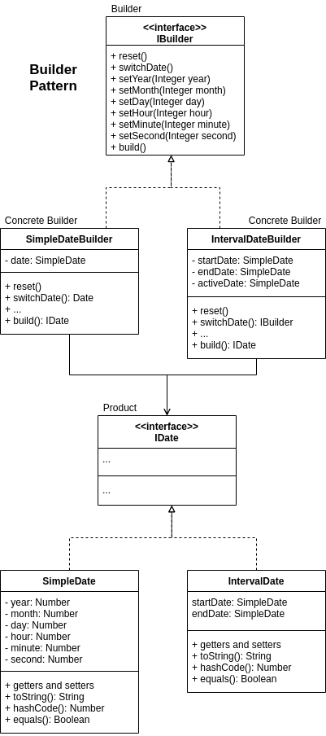
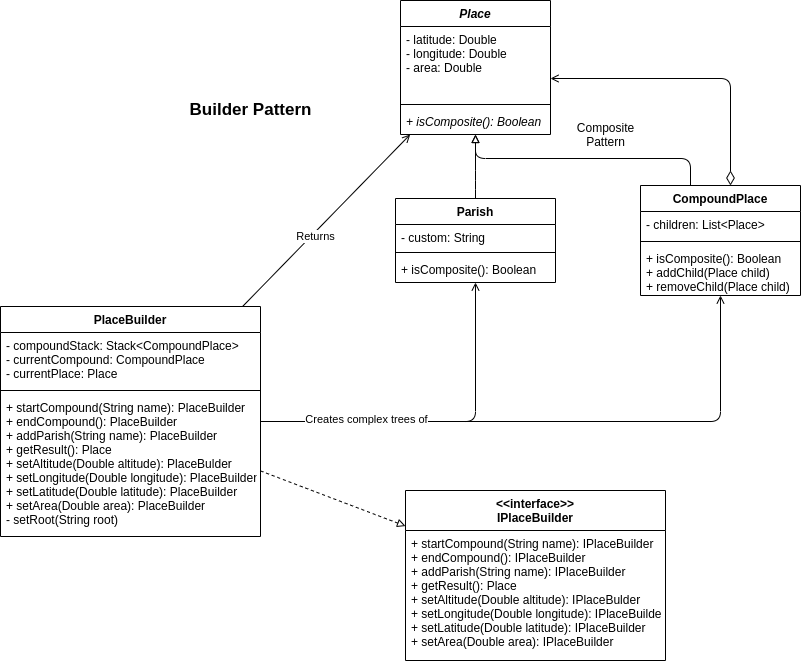

# Report

At this document it will be explained what was the process to develop this platform. This software system helps to support the work of historians and individual genealogy researchers by storing data related to individuals, their relations, and other important kinds of information.

# Table of contents
- [Report](#report)
- [Table of contents](#table-of-contents)
- [Functionalities Made So Far](#functionalities-made-so-far)
- [The Design](#the-design)
  - [Solving Simple Dates And Intervals](#solving-simple-dates-and-intervals)
    - [Design Problem](#design-problem)
    - [The Pattern](#the-pattern)
    - [Implementation](#implementation)
    - [Consequences](#consequences)
  - [Solving The Location Structure](#solving-the-location-structure)
    - [Design Problem](#design-problem-1)
    - [The Pattern](#the-pattern-1)
    - [Implementation](#implementation-1)
    - [Consequences](#consequences-1)
  - [Solving Exporting/Loading Data In Different Formats](#solving-exportingloading-data-in-different-formats)
    - [Design Problem](#design-problem-2)
    - [The Pattern](#the-pattern-2)
    - [Implementation](#implementation-2)
    - [Consequences](#consequences-2)
  - [Solving The Complexity Of Instantiating/Editing/Removing The Different Types Of Objects](#solving-the-complexity-of-instantiatingeditingremoving-the-different-types-of-objects)
    - [Design Problem](#design-problem-3)
    - [The Pattern](#the-pattern-3)
    - [Implementation](#implementation-3)
    - [Consequences](#consequences-3)
  - [Solving The Addition of Locations](#solving-the-addition-of-locations)
    - [Design Problem](#design-problem-4)
    - [The Pattern](#the-pattern-4)
    - [Implementation](#implementation-4)
    - [Consequences](#consequences-4)
# Functionalities Made So Far

The main functionalities of the program implemented already are:

- Allow record of **dates** (simple and interval)
- Allow record of **birth** event
- Allow record of **person** (missing birth event)
- Allow listing of **persons** 
- Allow record **sources** (missing places and date)
- Allow listing of **sources**

The main functionalities already started:

- Allow record of **places** (without GUI)
- Allow export in JSON and YAML (without GUI)
- Allow export the genealogy information to formats that allow a graphical visualization (without GUI) 

<!-- # Goals -->

# The Design

## Solving Simple Dates And Intervals

We'll start by explaining how we solved the problem of having uncertain dates.

### Design Problem

We have to save two different dates, **Interval** and **Simple** dates. The difference between them is that one just has a simple date (10-11-2021 00:00:00) and the other is an interval date (10-11-2021 00:00:00 - 24-12-2021 23:20:00). And this is not all, we also have to pay attention that dates may be incomplete.

The problem with dates was that they could be **incomplete**, which meant that we would need to have a lot of different constructors for the various possibilities or send params with null on the constructor.

### The Pattern

For the problem that we are trying to solve, the **Builder Pattern** is the one that best applies since the specification of the problem is exactly what it solves. The _Builder Pattern_ extracts the object construction code out of the class and moves it to separate objects called builders. This way it makes it possible to “build” a date without the need for complex constructors and in a more structured way. The pattern solves the problem of **two different types of dates** since we can have **different builders** for each of them.

### Implementation

For the implementation of the builder pattern, we created an interface **IBuilder** that contains all the methods to be implemented by the concrete builders: **SimpleDateBuilder** and **IntervalDateBuilder**. We had to create two concrete classes for the dates being created by the builders: **SimpleDate** and **IntervalDate**.



### Consequences

One of the consequences of the builder is that it doesn’t allow other objects to access the date while it’s being built and for this use case it doesn’t matter so we didn’t identify any other problem.

---

## Solving The Location Structure

Finding a structured way to store locations was also something we had to look into. We explain the process below.

### Design Problem

The problem is finding a structured way to **save locations**. These locations have the particularity that they can be **contained** within other locations or themselves contain thirds. For example, the district Porto is a location. Porto contains countys like Porto itself, Amarante, Felgueiras, Vila Nova de Gaia, etc. This countys are also locations and they can have other locations inside them.

Therefore, what needs to be resolved is this way of structuring locations so that districts can contain counties, counties can contain parishes, and in the end, everything that was listed above has to be called by location.

### The Pattern

The problem that was described above can be visually transcribed to a **tree structure** where there are parent locations that give rise to child locations. The pattern that allows the implementation of such structures is the **Composite Pattern**. This pattern is the best ally of this kind of tree structures so it was the one we chose to solve the location problem.

### Implementation

As far as implementation is concerned, we had to create a abstract class **Place** that has similar attributes to the different types of locations (latitude, longitude, area). This class plays the role of **Component** within what is estipulated by the **Composite Pattern**. Next we created, the **CompoundPlace** class which **extends Place** and plays the role of **Composite**. This _Composite_ schematizes the case of locations such as Porto that contains other locations and therefore need some way to aggregate others. The composite will allow this. It will have a list with all the children locations, all of them of the **Place** type. Which means that we can either add final locations (Leafs) or a Composite itself. Lastly, the **Parish** class also **extends Place** and refers to a location that will not include other locations. So, the **Parish** class, as it was implicitly said before, maps directly to a **Leaf** on the _Composite Pattern_.


### Consequences

- Positive consequences:
  - Thinking of the various locations as nodes in a tree is a very natural way to solve this data structuring problem.
  - It is a pattern that very easily incorporates with the **Builder Pattern** in order to allow the quick insertion of locations in the tree.
  - It will be necessary to iterate through these locations in order to choose the one that interests us. Given this, the composite pattern makes it easy to use an **Iterator Pattern** to traverse the various nodes of the tree.
- Negative consequences:
  - If for some reason a **Leaf** location becomes **Composite** we will need to add logic to transform this _Leaf_ into _Composite_ which may not be solved trivially.

---

## Solving Exporting/Loading Data In Different Formats

And now, how do we export, for instance the locations, in different formats?

### Design Problem

It was required to **load and save** data using **different formats** (e.g. YAML, XML, GEDCOM) and having in mind that new export formats should be easy to add.

The problem here was that not only would we need to use **many strategies** at a time to load or save data, but also that **some of the steps** required to do this will be **shared among all strategies**.

### The Pattern

To solve this problem, a mix of the **Strategy Pattern** and **Template Method Pattern** was used. It was used the **Strategy Pattern** in the sense that there are **various strategies** in place to load or save data in various formats which follow a **common interface**. With this, it is only necessary to **choose a strategy before using the same methods**, regardless of the strategy type. The Template Method Pattern was introduced to keep some of the data processing that all strategies follow in a common place. With this, these methods stay in the abstract class letting the specific work to be implemented by each strategy.

### Implementation


Since most of the steps are located on the abstract class, this implementation is more of a Template Method Pattern than a Strategy Pattern.

### Consequences

- Positive consequences:
  - By using this approach, not only is it possible to **add new support** for new types of files but also gives the freedom to the program to **switch between different strategies** of exporting or loading, just like it is necessary.
  - We are effectively **deleting repeated code** by putting it in abstract class.
- Negative consequences:
  - If the use of a specific type of file needs more steps than the general ones defined, it may need to join more than one step at the same method since we are limiting the structure of an algorithm.

---

## Solving The Complexity Of Instantiating/Editing/Removing The Different Types Of Objects

How can we **abstract the algorithmic complexity** of creating, editing or removing the different types of entities?

### Design Problem

It is necessary to create objects representing the various types of entities using a simple interface. The simplicity of this interface should be an advantage at the time of GUI implementation.

Assuming that we have to instantiate the various objects, such as instantiating events, people, locations, etc. The logic associated with these processes can become complex. Not only complex but extensive.

### The Pattern

The problem was solved by implementing a **Facade** for each of the entities. These facades implement methods that allow the creation of entities, edit them and remove them. The alternative would be to place this logic in the class responsible for the interaction with the user (currently the Main.class class) but it is expected that this class becomes **very extensive**, which would worsen its understandability, as well as its maintainability.

### Implementation

The implementation takes into consideration the various types of entities present in the project, in which each one of these entities, through its Facade, **abstracts the implementations** related to the creation, editing, removal (and possibly other types of operations) of the objects themselves. Specifically, we have Facades referring to the following entities: Source, Place, Person, Event, Date. All this facades are later used in the main program (Main.java) allowing to call the creation, editing, ... methods in a really simple way.


### Consequences

- Positive Consequences:
  - It will provide a **simple interface** to be used not only by the GUI but also by the main program.
  - Creates an abstraction that abstracts potentially complex code.
- Negative Consequences:
  - The various facades can very easily **become too general** and contain methods with very different scopes. The trend will be for these classes to become [God Object](https://en.wikipedia.org/wiki/God_object). Therefore, it will be necessary to have a doubled attention in the future so that this does not happen.

---

## Solving The Addition of Locations

How can we add locations easily?

### Design Problem

The application needs to create places and aggregate them following the concept of “Compound Place” and “Parish”. CompoundPlace is the aggregator of Parish at the most basic level, but in a composite pattern, we also need to take into consideration that the aggregator can also aggregate other aggregators.

In a simple way, in the Composite Pattern, the composite provides utility methods (like addChild and removeChild) that allows us to start creating the tree, but it requires us to **instantiate the composite object**, then instantiate all its children to be added via those utility methods. This is an approach that works, but it’s not actually **user friendly**.

### The Pattern

The builder pattern allows us to **build complex objects and structures step by step**.
It allows us to just say, “startComposite”, “startLeaf”, “startComposite” and it automatically generates the following:

```
Composite
	Leaf
	Composite
```

The pattern **extracts the complex code of creating objects** and puts it in a class that is only responsible for that exact task.

### Implementation

In the context of this problem, the builder pattern will allow us to build the tree of Places without knowing exactly what it does. Then the client just receives a Place and it doesn’t know if the object is a CompoundPlace or a Parish. The important, is that at the end the client receives a Place.



### Consequences

- Positive Consequences:
  - It guarantees that the responsibility of **instantiating new objects are deferred to another source** only responsible for creating those objects.
  - Simplifies the creation process of complex objects, abstracting that implementation.
  - In case the way the objects are instantiated changes, we can just swap the implementation of the builder pattern without affecting code that relies on that same builder.
- Negative Consequences:
  - A builder pattern introduces new classes, making it yet another piece of code to maintain.
  - Finding the common interface of a builder can be difficult if the object it’s trying to create is not the best one or it’s not final.
